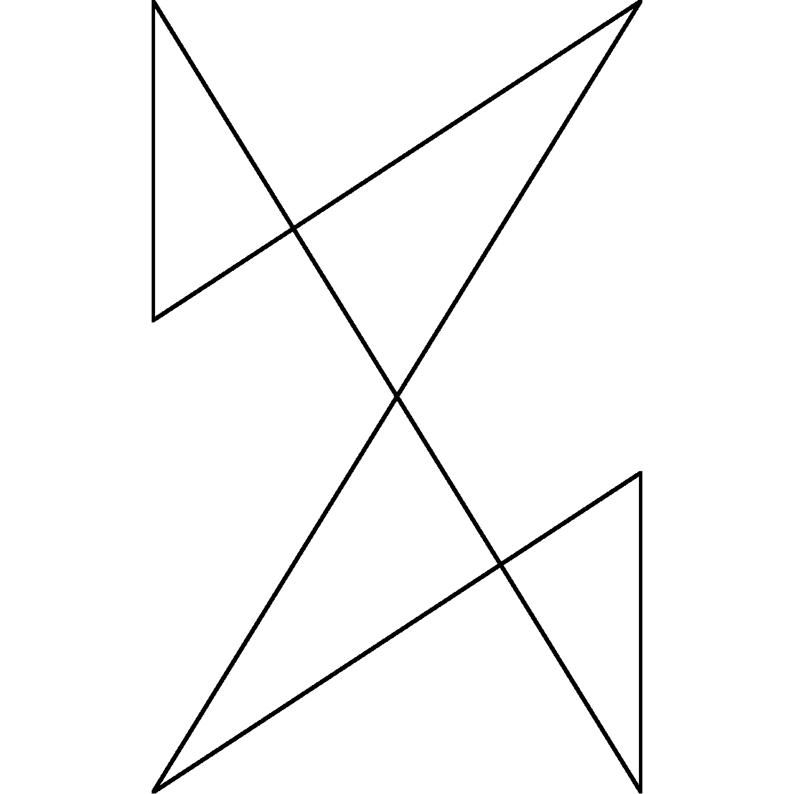

# Pillow Mod Loader

[中文](README.zh_hans.md) | English

## Icon

Credits: [Desmos](https://www.desmos.com/)

Make $a=\frac{\sqrt{5}+1}{2}, b=\frac{a+1}{4}$

Creating Points in a Planar Cartesian Coordinate System:

$A(0, a), B(1, a), C(1, 0), D(0, 0), E(0, a-b), F(1, b)$,
Connect $BE, CF, DF$

Connect $AE, AC, BD$ as PillowMC icons

Connect $AE, AC$ is the Pillow Mod Loader icon

Connect $BD$ and make $CG$ cross $G$ to make the extension line of $CG$ pass through $A$ as the Shear API icon

## Run Quilt and Fancy Mod Loader on ModLauncher together

This mod can let Quilt Loader and Fancy Mod Loader run on the top of ModLauncher with Minecraft obfuscated with Searge name.

## Developing Status
Almost done.

## Installing

Download the installer from GitHub releases, actions or other legal (see [License](#license)) places. Then use it like NeoForge installers. If you use HMCL, you can drag it to the automatic installation page.

## Support

_Not opened yet._

## License

This project is licensed under GPL v3.0 License since v0.3.4, LGPL v2.1 License since v0.3.1. Versions v0.3.0 or below is licensed under MIT License.
