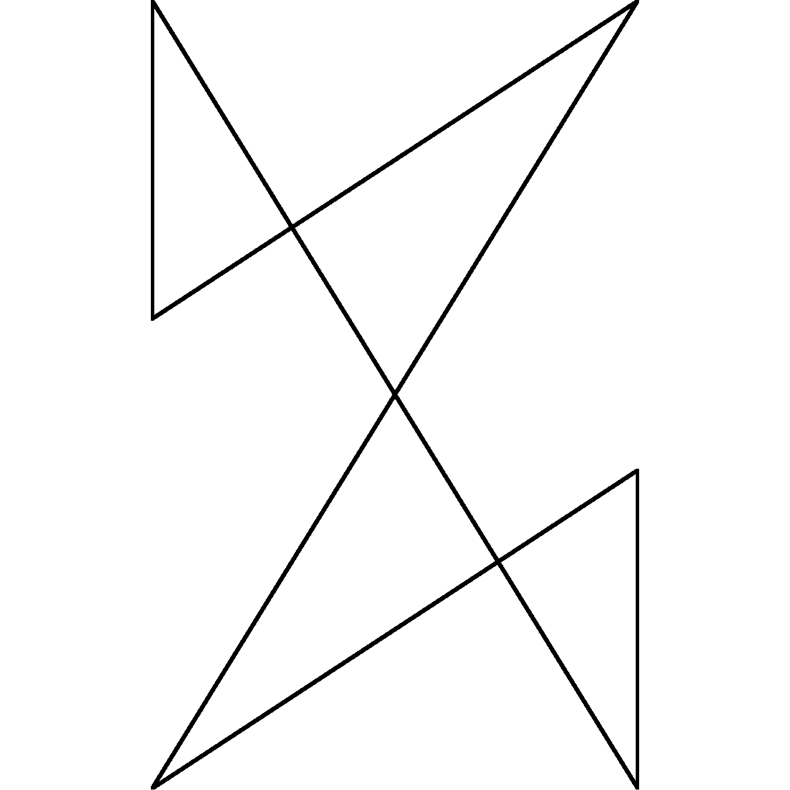

# 枕头模组加载器
_绝非机翻译名_

中文 | [English](README.md)

## 图标

鸣谢: [Desmos](https://www.desmos.com/)

令 $a=\frac{\sqrt{5}+1}{2}, b=\frac{a+1}{4}$

在平面直角坐标系中作点

$A(0, a), B(1, a), C(1, 0), D(0, 0), E(0, a-b), F(1, b)$,
连接 $BE, CF, DF$

连接 $AE, AC, BD$ 为 PillowMC 图标

连接 $AE, AC$ 为 Pillow Mod Loader 图标

连接 $BD$, 作 $CG$ 交 $G$ 使 $CG$ 延长线过 $A$ 为 Shear API 图标

## 运行在 ModLauncher 上的 Quilt 和 Fancy Mod Loader

这个模组会让 Quilt 加载器和 Fancy Mod Loader 在 ModLauncher 上和以 Searge 名混淆的 Minecraft 运行。

## 开发进度
几乎已经完成。目前除了生物群系 API 不兼容，QSL 和 QFAPI 各个模块均正常工作。

## 安装

_未开发_

## 支持

_未开放_

## 许可证

这个项目的许可证是 [MIT 许可证](LICENSE)。

Quilt 加载器项目的许可证是 [Apache](LICENSE.Quilt)。

Fancy Mod Loader 项目的许可证是 [LGPL 2.1](LICENSE.FancyModLoader)。
